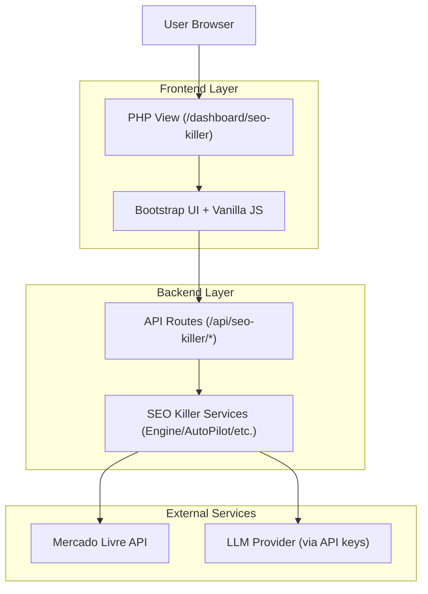

## 1.Architecture design


## 2.Technology Description
- Frontend: PHP server-rendered views + Bootstrap (tabs/modals) + Vanilla JS
- Backend: PHP (Controllers + Services)
- External libs (client-side): Chart.js (performance charts), Toastify (notificações)

## 3.Route definitions
| Route | Purpose |
|-------|---------|
| /dashboard/seo-killer | Página principal do SEO Killer (abas, stats, ferramentas e ações rápidas) |
| /dashboard/seo-killer/strategies | Página/aba complementar de estratégias (quando habilitada) |

## 4.API definitions (If it includes backend services)
### 4.1 Core API
Diagnóstico e visão geral
```
GET /api/seo-killer/diagnose
```

AutoPilot
```
GET /api/seo-killer/autopilot/config
POST /api/seo-killer/autopilot/enable
POST /api/seo-killer/autopilot/disable
GET /api/seo-killer/autopilot/history?limit=5
```

Top performers e performance
```
GET /api/seo-killer/top-performers
GET /api/seo-killer/performance/dashboard
```

Type shapes (contratos de resposta; referência para frontend)
```ts
export type ApiOk<T> = { success: true } & T;
export type ApiError = { success?: false; error: string };

export type DiagnoseStats = {
  total: number;
  optimized: number;
  pending: number;
  avgScore: number | null;
};

export type DiagnoseResponse = ApiOk<{ stats: DiagnoseStats }> | ApiError;

export type AutopilotConfig = { enabled: boolean; /* demais campos existentes */ };
export type AutopilotConfigResponse = ApiOk<{ config: AutopilotConfig }> | ApiError;

export type AutopilotHistoryItem = {
  created_at: string;
  status: 'completed' | 'running' | 'failed' | string;
  items_processed?: number;
  description?: string;
};
export type AutopilotHistoryResponse = ApiOk<{ history: AutopilotHistoryItem[] }> | ApiError;
```

## 5.Server architecture diagram (If it includes backend services)
```mermaid
graph TD
  A["Browser"] --> B["Controller Layer (SEOKillerController)"]
  B --> C["Service Layer (Engine/Killers/AutoPilot)"]
  C --> D["Integration Layer (ML Client + LLM Client)"]

  subgraph "