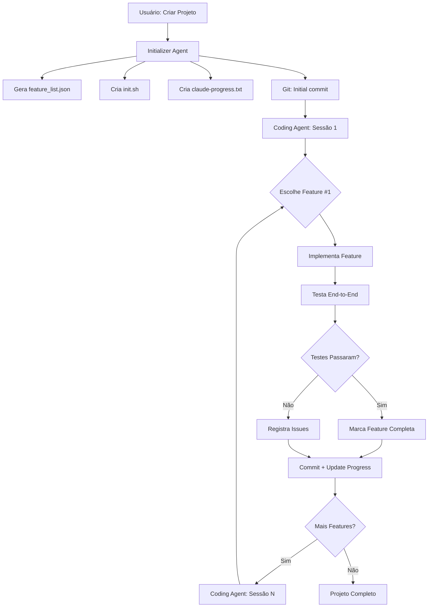

# 🤖 Long-Running Agents System

Sistema de agentes de longa duração para desenvolvimento autônomo de software, baseado nas práticas da Anthropic.

**Artigo de Referência:** [Effective Harnesses for Long-Running Agents](https://www.anthropic.com/engineering/effective-harnesses-for-long-running-agents)

---

## 📋 Visão Geral

Este sistema implementa um harness para long-running agents capaz de trabalhar em projetos complexos através de múltiplas sessões (context windows), mantendo consistência e progresso incremental.

### Problemas Resolvidos

1. **One-shotting**: Agente tenta fazer tudo de uma vez, esgotando contexto
2. **Premature Victory**: Agente declara projeto completo prematuramente
3. **Inconsistent State**: Código fica em estado inconsistente entre sessões
4. **Missing Tests**: Features marcadas como completas sem validação end-to-end

### Solução: Arquitetura em Duas Partes

#### 1. Initializer Agent (Primeira Sessão)
- Expande requisitos em feature list detalhada (100+ features)
- Cria `feature_list.json` com todas as features
- Cria `init.sh` para iniciar servidor de desenvolvimento
- Cria `claude-progress.txt` para tracking
- Setup inicial do projeto (estrutura, deps, config)
- Primeiro commit git

#### 2. Coding Agent (Sessões Subsequentes)
- Trabalha em **UMA feature por vez**
- Sempre deixa código em "clean state" (pronto para merge)
- Testa end-to-end antes de marcar como completo
- Faz commit + atualiza progress log
- **NUNCA** marca feature como "passing" sem testes

---

## 🏗️ Arquitetura

```
app/Services/Agent/
├── AgentService.php              # Orquestrador principal
├── InitializerAgent.php          # Setup inicial (1ª sessão)
├── CodingAgent.php               # Trabalho incremental
├── TestingAgent.php              # Validação end-to-end
├── FeatureListManager.php        # Gerencia feature_list.json
└── AgentProgressTracker.php      # Tracking de progresso
```

### Fluxo de Trabalho



---

## 📁 Estrutura de Projeto Agent

Cada projeto criado tem a seguinte estrutura:

```
storage/agent_projects/{project_id}/
├── feature_list.json           # Lista de features (JSON)
├── claude-progress.txt         # Log de progresso
├── init.sh                     # Script de inicialização
├── README.md                   # Documentação
├── .git/                       # Repositório git
├── src/                        # Código fonte
├── tests/                      # Testes
├── config/                     # Configurações
└── public/                     # Assets públicos
```

### feature_list.json

```json
[
  {
    "id": "F1",
    "category": "functional",
    "description": "User can create a new todo item",
    "steps": [
      "Navigate to dashboard",
      "Click 'New Todo' button",
      "Fill in todo details",
      "Click 'Save'",
      "Verify todo appears in list"
    ],
    "passes": false,
    "priority": "high",
    "tested_at": null,
    "test_results": null
  },
  {
    "id": "F2",
    "category": "functional",
    "description": "User can mark todo as complete",
    "steps": [...],
    "passes": false,
    "priority": "high"
  }
]
```

### claude-progress.txt

```markdown
# Claude Progress Log

## Project: Todo App with Auth
**Initialized:** 2025-12-21 10:00:00
**Total Features:** 25

---

## Session Log

---
## Session #1 - 2025-12-21 10:15:00
**Type:** Coding Agent
**Feature:** F1 - User can create a new todo item
**Status:** Completed ✓

### Changes Made:
- Implemented TodoController with create action
- Added TodoService with validation logic
- Created todo creation form
- Added end-to-end tests

### Files Modified:
- src/Controllers/TodoController.php
- src/Services/TodoService.php
- src/Views/todos/create.php
- tests/Feature/TodoCreationTest.php

### Tests:
✓ All end-to-end tests passed
  - User can navigate to create form
  - User can fill form and submit
  - Todo appears in list after creation

**Commit:** a1b2c3d
---
```

---

## 🔌 API Endpoints

### 1. Iniciar Projeto

```http
POST /api/agent/projects/start
Content-Type: application/json

{
  "name": "My Todo App",
  "description": "Build a todo app with user authentication and categories",
  "category": "dashboard",
  "requirements": [
    "User registration and login",
    "Create, edit, delete todos",
    "Organize todos by category",
    "Set due dates and priorities"
  ]
}
```

**Response:**
```json
{
  "success": true,
  "data": {
    "project_id": 1,
    "status": "initialized",
    "features_count": 28,
    "init_files_created": [
      "feature_list.json",
      "claude-progress.txt",
      "init.sh",
      "README.md"
    ],
    "next_action": "run_coding_session"
  }
}
```

### 2. Executar Sessão de Coding

```http
POST /api/agent/projects/{project_id}/session
```

**Response:**
```json
{
  "success": true,
  "data": {
    "session_id": "session_abc123",
    "feature_worked_on": "F1",
    "feature_completed": true,
    "tests_passed": true,
    "files_modified": [
      "src/Controllers/TodoController.php",
      "src/Services/TodoService.php"
    ],
    "commit_hash": "a1b2c3d",
    "next_feature": {
      "id": "F2",
      "description": "User can mark todo as complete"
    },
    "project_completion": 3.57
  }
}
```

### 3. Obter Status do Projeto

```http
GET /api/agent/projects/{project_id}/status
```

**Response:**
```json
{
  "success": true,
  "data": {
    "project": {
      "id": 1,
      "name": "My Todo App",
      "status": "in_progress"
    },
    "completion_percentage": 35.71,
    "total_features": 28,
    "completed_features": 10,
    "pending_features": 18,
    "sessions_count": 12,
    "last_activity": "2025-12-21 14:30:00",
    "features_breakdown": {
      "functional": 15,
      "ui": 8,
      "performance": 3,
      "security": 2
    }
  }
}
```

### 4. Testar Feature Específica

```http
POST /api/agent/projects/{project_id}/test
Content-Type: application/json

{
  "feature_id": "F1"
}
```

**Response:**
```json
{
  "success": true,
  "data": {
    "feature_id": "F1",
    "feature_description": "User can create todo",
    "tests": [
      {
        "description": "Navigate to create form",
        "passed": true,
        "duration_ms": 150
      },
      {
        "description": "Fill and submit form",
        "passed": true,
        "duration_ms": 320
      }
    ],
    "all_tests_passed": true,
    "issues": [],
    "console_errors": []
  }
}
```

---

## 🎯 Boas Práticas Implementadas

### 1. Trabalho Incremental

✅ **Coding Agent trabalha em UMA feature por vez**
- Evita tentar fazer tudo de uma vez
- Reduz risco de esgotar contexto
- Facilita debugging e rollback

### 2. Clean State

✅ **Código sempre em estado "pronto para merge"**
- Sem half-implemented features
- Sem bugs óbvios
- Documentação atualizada
- Testes passando

### 3. Progress Tracking

✅ **Múltiplas formas de tracking**
- `feature_list.json` - status de cada feature
- `claude-progress.txt` - log narrativo
- Git commits - histórico de mudanças
- Banco de dados - analytics e queries

### 4. Testing First

✅ **Features só marcadas como "passing" após testes end-to-end**
- Testing Agent testa como usuário real
- Browser automation quando possível
- Valida cada step da feature
- Registra screenshots e erros

### 5. Context Management

✅ **Cada sessão começa com "get bearings"**
```php
// Workflow padrão de cada sessão
1. pwd - ver diretório de trabalho
2. git log - ver commits recentes
3. cat claude-progress.txt - ver progresso
4. cat feature_list.json - ver features pendentes
5. ./init.sh - iniciar servidor
6. Run smoke tests - garantir app ainda funciona
7. Implementar feature
8. Test end-to-end
9. Commit + atualizar progress
```

---

## 🚀 Como Usar

### Setup Inicial

```bash
# Criar diretório para projetos
mkdir -p storage/agent_projects
chmod 777 storage/agent_projects

# Executar migrations (cria tabelas)
php scripts/migrate_agent_system.php
```

### Criar Novo Projeto

```bash
curl -X POST http://localhost/api/agent/projects/start \
  -H "Content-Type: application/json" \
  -d '{
    "name": "E-commerce Platform",
    "description": "Build a complete e-commerce with cart, checkout, and admin",
    "category": "ecommerce",
    "requirements": [
      "Product catalog with search and filters",
      "Shopping cart and checkout flow",
      "User authentication and profiles",
      "Admin dashboard for inventory"
    ]
  }'
```

### Executar Sessões

```bash
# Executar primeira sessão de coding
curl -X POST http://localhost/api/agent/projects/1/session

# Ver status
curl http://localhost/api/agent/projects/1/status

# Testar feature específica
curl -X POST http://localhost/api/agent/projects/1/test \
  -H "Content-Type: application/json" \
  -d '{"feature_id": "F1"}'

# Continuar com mais sessões
curl -X POST http://localhost/api/agent/projects/1/session
curl -X POST http://localhost/api/agent/projects/1/session
# ... até completar todas as features
```

---

## 🔧 Configuração Avançada

### Integração com LLM (Claude)

Em produção, `CodingAgent` e `TestingAgent` fariam chamadas para API do Claude:

```php
// CodingAgent::implementFeature()
$client = new \Anthropic\Client(getenv('ANTHROPIC_API_KEY'));

$response = $client->messages()->create([
    'model' => 'claude-opus-4.5',
    'max_tokens' => 180000,
    'messages' => [
        [
            'role' => 'user',
            'content' => $this->buildPrompt($feature, $context)
        ]
    ]
]);

// Extrair código e arquivos da resposta
$result = $this->parseResponse($response);
```

### Browser Automation

Integrar com Puppeteer MCP Server ou Selenium:

```php
// TestingAgent::executeBrowserStep()
$browser = new \MCP\Puppeteer\Browser();
$page = $browser->newPage();
$page->goto($this->getServerUrl($projectId));

if (stripos($step, 'click') !== false) {
    $selector = $this->extractSelector($step);
    $page->click($selector);
}

$screenshot = $page->screenshot();
$browser->close();
```

---

## 📊 Monitoramento

### Métricas Disponíveis

- **Features por categoria**: Quantas functional, ui, performance, security
- **Taxa de conclusão**: % de features completadas
- **Sessões por feature**: Média de sessões até completar
- **Testes passando**: % de testes end-to-end passando
- **Tempo médio por feature**: Análise de performance

### Queries Úteis

```sql
-- Features pendentes de alta prioridade
SELECT * FROM agent_features
WHERE passes = FALSE AND priority = 'high'
ORDER BY id;

-- Progresso por categoria
SELECT 
    category,
    COUNT(*) as total,
    SUM(CASE WHEN passes THEN 1 ELSE 0 END) as completed
FROM agent_features
WHERE project_id = 1
GROUP BY category;

-- Sessões recentes
SELECT * FROM agent_progress_log
WHERE project_id = 1
ORDER BY created_at DESC
LIMIT 10;
```

---

## 🎓 Lições da Anthropic

### DO ✅

1. **Use Initializer Agent** para setup inicial completo
2. **Trabalhe incrementalmente** - uma feature por vez
3. **Teste end-to-end** antes de marcar como completo
4. **Mantenha progress log** estruturado
5. **Use git commits** descritivos
6. **Deixe clean state** após cada sessão
7. **Get bearings** no início de cada sessão
8. **Use init.sh** para setup consistente

### DON'T ❌

1. **Não tente one-shot** o projeto inteiro
2. **Não marque features sem testar**
3. **Não edite/remova features** do feature_list.json
4. **Não declare vitória** prematuramente
5. **Não deixe código half-implemented**
6. **Não pule testes** para economizar tempo
7. **Não ignore baseline tests**
8. **Não assuma que código funciona** sem validar

---

## 🔮 Melhorias Futuras

- [ ] Multi-agent architecture (Testing Agent, QA Agent, Cleanup Agent)
- [ ] Integração com Puppeteer MCP Server
- [ ] Análise automática de code coverage
- [ ] Estimativa de tempo por feature
- [ ] Dashboard web para visualização
- [ ] Integração com CI/CD
- [ ] Auto-recovery de sessões falhadas
- [ ] Suporte a diferentes linguagens/frameworks

---

## 📚 Referências

- [Anthropic - Effective Harnesses for Long-Running Agents](https://www.anthropic.com/engineering/effective-harnesses-for-long-running-agents)
- [Claude Agent SDK](https://platform.claude.com/docs/en/agent-sdk/overview)
- [Claude 4 Prompting Guide](https://docs.claude.com/en/docs/build-with-claude/prompt-engineering/claude-4-best-practices)

---

## 💡 Exemplos de Uso

### Exemplo 1: Dashboard Completo

```bash
# Criar projeto
curl -X POST http://localhost/api/agent/projects/start \
  -d '{
    "name": "Admin Dashboard",
    "category": "dashboard",
    "description": "Complete admin dashboard with analytics, user management, and settings"
  }'

# Output: project_id = 2, features_count = 45

# Executar sessões até completar
for i in {1..45}; do
  curl -X POST http://localhost/api/agent/projects/2/session
  sleep 5
done
```

### Exemplo 2: API REST

```bash
curl -X POST http://localhost/api/agent/projects/start \
  -d '{
    "name": "Blog API",
    "category": "api",
    "requirements": [
      "CRUD for posts, comments, users",
      "Authentication with JWT",
      "Rate limiting",
      "OpenAPI documentation"
    ]
  }'
```

---

**Versão:** 1.0.0  
**Última Atualização:** 2025-12-21  
**Autor:** Sistema Eskill ML Manager
